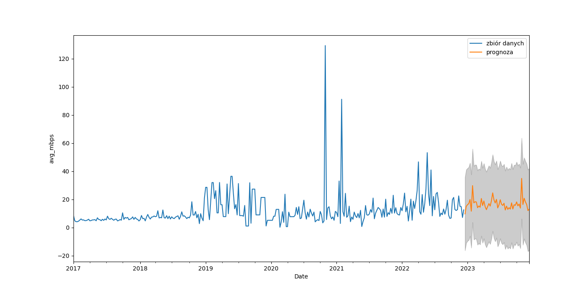

# Predyktor przepustowości sieci internetowej
> Projekt został stworzony na potrzeby uczelnianego kursu eksploracja danych.

## Spis treści
* [Informacje Ogólne](#informacje-ogólne)
* [Wykorzystane Technologie](#wykorzystane-technologie)
* [Uruchomienie](#uruchomienie)
* [Opis projektu](#opis-projektu)

## Informacje ogólne
Projekt zawiera analizę przepustowości sieci internetowej oraz jej prognozę dla wybranego operatora
sieciowego na terenie miasta Wrocław, na podstawie danych dostępnych z międzynarodowego projektu "MLab project".
Baza danych poddanych analizie zawiera wyniki dobrowolnych testów prędkości przeprowadzonych przez użytkowników
na całym świecie na witrynie [_https://speed.measurementlab.net_](https://speed.measurementlab.net).

Otrzymany zbiór danych został zamieszczony w folderze [dataset](./dataset) pliku projektu, natomiast folder [figure](./figure) zawiera wykresy wygenerowane przez program.

## Wykorzystane technologie
- SQL 
- Python 3.10

## Uruchomienie
Do poprawnego działania programu potrzebne są następujące biblioteki oraz pakiety:
- numpy  
- pandas
- intertools  
- statsmodels.tsa.api (Holt, SimpleExpSmoothing, adfuller, seasonal_decompose)
- statsmodels.api
- matplotlib.pyplot
- seaborn 
- datetime

## Opis projektu
W celu przeprowadzenia prognozy zostały dokonane wstępne badania mające na celu znalezienie odpowiedniego modelu precykcji dla zbioru danych, których poszukiwania
zostały zawarte w programie. 
Zostały dokonane następujące kroki badawcze przygotowujące zbiór danych i mające na celu znalezienie odpowiedniego modelu predyckji:
- stworzenie zapytania SQL mającego pobrać dane poddane analizie
- zaindeksowanie daty oraz wprowadzenie okresowości danych
- sprawdzenie sezonowości oraz trednu zbioru
- sparwdzenie oraz dokonanie stacjonarności zbioru danych
- uwtorzenie zestawu szkoleniowego i testowego
- poszukiwanie modelu danych szkoleniowych i testowych dla modelu wygładzania wykładniczego, trendu liniowego Holta i SARIMA
- sprawdzenie poprawności wybranego modelu poprzez wykonanie wykresów diagnostycznych rozkładu normalnego
- stworzenie prognozy dla wybranego modelu SARIMA.

Zostały otrzymane następujące wyniki prognozy dla zbioru danych na kolejne 52 tygodnie od 2022-12-18 do 2023-12-10

Pełen opis projektu znajduję się w stworzonym raporcie: [_raport z projektu_](https://docs.google.com/document/d/1mJLslMJ6Cj-UcO4bnO7-YmlLV5nHEok-/edit?usp=share_link&ouid=110070363137970605267&rtpof=true&sd=true)

